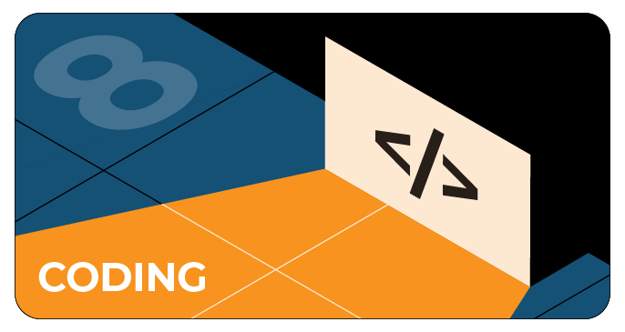

# Задачи на Heisenbug 2020 Piter

На GitHub мы проведем конкурс для тех, кто хочет покодить. На нашей странице вы найдете задачи. После решения задачи нужно засабмитить ее в Pull Requests.

Решать задачи можно будет и после конференции:: мы будем принимать ответы до 18.00 четверга (18 июня). Победителей мы объявим в пятницу 19 июня. Каждый из них получит промокод на бесплатный Full Pass.

[Ссылка на репозиторий с задачами](https://github.com/JUGRuGroupOnline/HeisenbugPiter2020)

# Конкурс Top Post

## Top post в Инстаграм
1. Сделать композиционное фото, на котором виден экран монитора или гаджета с трансляцией конференции Heisenbug. Композиция может быть шуточной, милой, творческой. Пример фото: ноутбук с трансляцией Heisenbug, а на клавиатуре лежит голова спящего кота и т.д.
2. Использовать хэштег конференции #янаheisenbug
3. Упомянуть профиль Heisenbug (@heisenbug_conf)

Мы определим победителя к концу конференции, т.е 18 июня. Объявление победителя произойдет на закрытии конференции.
Приз: 1 бесплатный билет fullpass!

## Top post в Твиттере
1. В 270 символов уложить свой отзыв об участии в конференции. Отзыв может быть в необычной форме: рифма, шутка, хокку
2. Необходимо отметить аккаунт Heisenbug и указать хэштег #янаheisenbug
3. Можно писать неограниченное количество твитов для победы

Мы определим победителя к концу конференции, т.е 18 июня. Объявление победителя произойдет на закрытии конференции.
Приз: 1 бесплатный билет fullpass!
